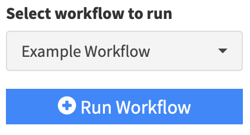

```{r, include = FALSE}
knitr::opts_chunk$set(
  collapse = TRUE,
  comment = "#>"
)
```

# Introduction

Sometimes it is useful to be able to preload content into the app. This
can take a few forms. In the most basic you may want to save the current
analysis and reload it at a later date. Often you may have standard
analyses that you want to run when a dataset of a particular format has
been loaded. Lastly, you may want to set the app up so that it starts
with a bunch of preloaded content so the user can play around with it.
The following will outline how to do each of these tasks.

## Saving and loading an analysis

This is the most straightforward method but it is mentioned here because
it is the most likley way a user would set up the other two scenarios
below. You can load a dataset and populate any of the modules with
content like normal. Then you would go to the save analysis portion of
the app (under App State) and just select save. This should push a zip
file to you with the current analysis saved inside of ti. To reload this
analysis you can load the zip file and it should repopulate the analysis
for you. **The key here is to refresh the app so it is "empty" before
loading it.**

If you open that zip file you will notice a file called `preload.yaml`
along with your original dataset. This yaml file is needed below to
create workflows and prelaod the app.

## Creating automated workflows

To create automated workflows you need one or more preload files. You
will deploy these along with the app. The first thing you will need to do is
create a copy of the app (or your own app) in the deployment directory. You can
do this using this command

```r
file.copy(from = system.file(package="formods","templates", "FM_compact.R"), 
          to   = "App.R")
```

Certain features of the app behave differently depending on whether it is running locally or deployed on a server. If you want to deploy the app you need to tell the App it is deployed. This is done by creating an empty file named DEPLOYED in the same directory as the deployed app file. This is optional.

```r
file.create("DEPLOYED")
``` 

If you look at the top of the `App.R` file you created you will see something like this:

```r
formods.yaml  = system.file(package="formods",  "templates",  "formods.yaml")
ASM.yaml      = system.file(package="formods",  "templates",  "ASM.yaml")
UD.yaml       = system.file(package="formods",  "templates",  "UD.yaml")
DW.yaml       = system.file(package="formods",  "templates",  "DW.yaml")
FG.yaml       = system.file(package="formods",  "templates",  "FG.yaml")
```

These are the configuration files for each module. The workflow information is stored in the `formods.yaml` file. You'll need to create a local version you can edit and fill with your workflow information. 

```r
file.copy(from = system.file(package="formods", "templates",  "formods.yaml"),
          to   = "myformods.yaml")
```
          
To make your app use this file you need to edit it and change the assignment of the `formods.yaml` object:

```r
formods.yaml       = "myformods.yaml"
```

If you edit the file `myformods.yaml` you will see a section called workflows:
          
```yaml
  workflows:
    example: 
      group:      "Examples"
      desc:       "Example Workflow"
      # Set to true if the workflow requires a dataset
      require_ds: TRUE
      # this can contain an aboslute path as a string or R evaluable code
      preload:    "file.path('.', 'example.yaml')"
```

This is be a pre-populated example showing how to creaet a workflow. You can create as many workflows as you want here by giving them different names from example above (copy/paste example, change the name, and alter the details). The group option will allow you to group your workflows together in the selection form. The description (`desc`) is a verbose description of the workflow and `require_ds` indicates if the workflow depends on a dataset. This should probably be true. The `preload` field points to the yaml file that has the workflow details. This is the `preload.yaml` file you will extract from the zip file created when saving an analysis. You need to copy that file to the deployment directory and rename it to whatever is referenced here (e.g. `preload.yaml` to `example.yaml`).

Now you should have the following files in the directory:

- `App.R`: App file edited to use the custom formods configuration file.
- `DEPLOYED`: Empty file indicating the app is deployed.
- `myformods.yaml`: Customized formods file to indicate the available workflows
- `example.yaml`: Example workflow.

If you set this up correctly and it finds at least one workflow yaml file specified it should create a workflow selection element and button to run the selected workflow in the data upload section of the app like this:

{width=200}

## Preloading the app with content

First you need to unzip the contents of the save analysis into a directory. Next, in the same directory where you unziped the contents of the analysis,  you need to create an app file and also create the DEPLOYED file if you want to deploy the app. This will use the test app that ships with `formods`:

```r
file.copy(from = system.file(package="formods","templates", "FM_compact.R"), 
          to   = "App.R")
file.create("DEPLOYED")
``` 

Now when you run the app, the preload file will be detected and the contents will be loaded into the app. This is done with the following code in the app:

```r
if(file.exists("preload.yaml")){
  shinybusy::show_modal_spinner(text="Preloading analysis, be patient", session=session)
  res = FM_app_preload(session=session, sources="preload.yaml")
  shinybusy::remove_modal_spinner(session = session)
}
``` 
